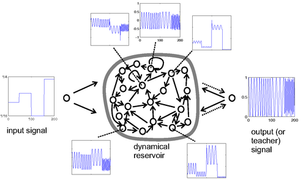

@import "themes/typing.css"

# [Echo state network](http://www.scholarpedia.org/article/Echo_state_network)

_Author: Herbert Jaeger, Jacobs University Bremen, Bremen, Germany_

对于前馈神经网络，一种便捷的训练方式是将其input->hidden和hidden->hidden之间的连接权重随机且固定，然后仅训练最后一层，即仅训练hidden->output间的连接权重，而最后的hidden层与output层之间实际为线性模型。通过这种方式，我们得到了一个具有非线性能力同时训练又非常快速的随机前馈神经网络。

在随机前馈神经网络的启发下，类似的思想可以应用在循环神经网络Recurrent Neural Network（RNN）上。相同的，我们将RNN中的input->hidden和hidden->hidden间连接权重随机固定，仅学习hidden->output间的连接权重。这种具有随机机制的RNN便是Jaeger（2001）所提出的Echo state network（ESN）。

更具体一点讲，ESN的主要思想是建立一个随机的、固定的、多循环神经元的循环神经网络来进行有监督的学习。在ESN的观点中，循环神经元的组合被视为循环池Reservoir，输入的信号在循环池中的各神经元处各得到一种非线性的前馈信号，然后将这些非线性的信号加以组合得到Reservoir的最后一层状态。此时，Reservoir与output之间的训练过程即为训练Reservoir中产生的前馈信号组去逼近目标信号的过程，即一种线性组合的训练过程。

例如，训练ESN去生成一个Sin函数。输入$u(n)$是一组低频信号，目标$y(n)$是一组对应当前输入的sin信号。假设训练集为$D = (u(1),y(1)),\ldots, (u(n_{max}),y(n_{max}))$